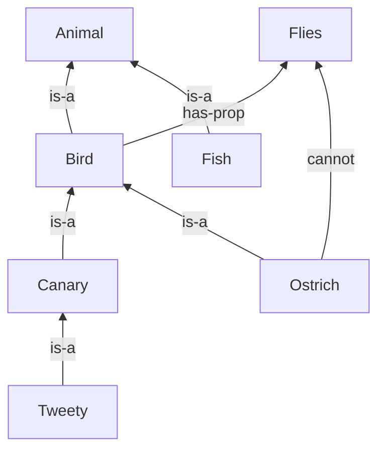

**Sources:** `References/01204461 Week 1.pdf`; `References/01204461 Week 2.pdf` pages 70–86 (Chapter 1 finish)  
Logistics: [[0 - Course Syllabus]]

## Outline

1. [[#1. What is AI?]]
2. [[#2. Classical AI — rules, search, expert systems]]
3. [[#3. Machine learning and the AI map]]
4. [[#4. Four ways to define AI]]
5. [[#5. History in brief]]
6. [[#6. Agents]]
7. [[#7. PEAS]]
8. [[#8. Environment properties]]
9. [[#9. Types of agents]]
10. [[#10. Knowledge Representation and Propositional Logic]]
11. [[#11. Structured Knowledge Representation (1.9.3)]]
12. [[#12. Memory Structures (1.10)]]
13. [[#13. Expert Systems (1.11)]]
    1. [[#13.1 Forward and Backward Chaining (1.11.1)]]
14. [[#14. Knowledge Representation Summary (1.11.2)]]
15. [[#Practice questions]]

---

## 1. What is AI?

- AI is the science and engineering of systems that perceive, reason, learn, and act to achieve goals.
- Russell & Norvig define it through intelligent agents: systems that take percepts from the environment and choose actions that maximize expected goal achievement.
- AI's aim isn't just "imitate a human", the working target is rational action: the best decision given available information.
- *Major subfields*: Machine Learning, Knowledge Representation and Reasoning, Search and Planning, Computer Vision, NLP, Robotics, Generative AI.
![[ai_fields.png]]
---

## 2. Classical AI — rules, search, expert systems

### 🧠 Rule-based systems

Humans write knowledge as `if–then` rules. Factory example:

> if (temperature > 100°C) ∧ (pressure > 200 bar) then alarm = CRITICAL

**Three failures:**
- **Hard to build** — every case needs a hand-written rule.
- **Rigid** — anything off-script fails.
- **Cannot adapt** — the environment changes, a person rewrites the rules.

### 🧠 Search

- Classical AI = state-space search: *nodes are states, edges are actions*; BFS/DFS/A* find a path from start to goal — not database lookup, since states are generated on the fly.
- Scale is combinatorial (100 moves × 50 steps → 100^50 paths), so heuristics let A*/minimax with alpha–beta pruning skip most of the tree (tic-tac-toe game tree = this in miniature).
- Classical AI vs. ML: *humans encode rules* and the machine searches, vs. *ML learns the rules from data*.

### 🧠 Expert systems

A richer rule-based architecture, generally consists of two main parts:

| Part                    | Job                                                                              |
| ----------------------- | -------------------------------------------------------------------------------- |
| **1. Knowledge base**   | Stores facts and expert-written rules (the *what we know*)                       |
| **2. Inference engine** | Applies those rules to the facts to derive new conclusions (the *how we reason*) |
**Analogy**: *knowledge = cookbook*, the *inference engine is the chef* who reads it and decides what to actually cook given what's in the fridge.

**MYCIN** (Stanford, 1970s, Edward Shortliffe): ~600 IF–THEN rules, certainty factors, diagnoses blood infections (bacteremia, meningitis) and recommends antibiotics. Architecture (KB + engine + WM): [[#13. Expert Systems (1.11)]].

*Still cannot learn by itself*. Updating a huge knowledge base is expensive; the same flaw, scaled up.

---

## 3. Machine learning and the AI map

Tom Mitchell (1997):

> A program **learns** from experience $E$ on tasks $T$ as measured by $P$ if performance on $T$ improves with $E$.

| Piece   | Question                | Examples                                              |
| ------- | ----------------------- | ----------------------------------------------------- |
| **$T$** | What to learn?          | Classify images, predict house prices, detect defects |
| **$E$** | What to learn from?     | Historical records, sensors, images                   |
| **$P$** | How to measure success? | Accuracy, precision/recall, F1, MSE                   |

If more data makes $P$ go up, it learned. Rules are discovered, not typed in.

![[ai_taxonomy.png]]

**AI is broader**: KR, search, planning, robotics, vision, NLP also sit under AI without being “just ML.”

| Branch                    | What it is                                                      |
| ------------------------- | --------------------------------------------------------------- |
| **Rule-based / symbolic** | Logic, search (BFS, DFS, $A^*$), planning, hand-written rules   |
| **Expert systems**        | Knowledge base + working memory + inference engine              |
| **Machine learning**      | Patterns from data → predictions                                |
| **Deep learning**         | Deep nets that learn hierarchical features                      |
| **Generative AI**         | New content (text, images, audio, code) — LLMs, diffusion, GANs |

---

## 4. Four ways to define AI

Two axes:

1. **Thinking vs acting** — internal reasoning, or visible behavior?
2. **Humanlike vs rational** — copy people, or maximize goals?

|               | **Think**                                                                                                        | **Act**                                                                                                               |
| ------------- | ---------------------------------------------------------------------------------------------------------------- | --------------------------------------------------------------------------------------------------------------------- |
| **Humanlike** | **Thinking humanly** — cognitive modeling: emulate human reasoning, grounded in *psychology* & cognitive science | **Acting humanly** — *Turing Test*: *behave* indistinguishably from a human (e.g., conversation, problem solving)     |
| **Rational**  | **Thinking rationally** — "laws of thought": use *formal logic* to derive correct *conclusions from facts*       | **Acting rationally** — rational agent: select *actions* expected to *best achieve goals* given available information |
### Acting humanly: the Turing Test (1950)

![[turing_test.png|590]]

Turing replaced “Can machines think?” with the **Imitation Game**: an interrogator *chats by text with a hidden human and a hidden program*. If they *cannot tell* which is which, the *machine passes*.

To pass the Total Turing Test (which includes physical & perceptual interaction), an AI agent must master six fundamental disciplines:

1. *Natural Language Processing (NLP)*: To communicate fluently in human languages.

2. *Knowledge Representation*: To store facts, concepts, and relationships.

3. *Automated Reasoning*: To use stored knowledge to answer questions and deduce logical conclusions.

4. *Machine Learning*: To adapt to new situations and discover patterns from data.

5. *Computer Vision*: To perceive physical objects and visual inputs.

6. *Robotics / Manipulation*: To physically move objects and navigate the environment.

### Why Modern AI Focuses on Rationality over Human Imitation

- Humans are *biased and forgetful*. Copying those flaws is not engineering.
- Planes are not mechanical birds. Build what **works**.
- **Acting rationally is broader than thinking rationally.** Logic is useful, but a rational agent must still act under uncertainty and time limits when a full proof is impossible.

---

## 5. History in brief

AI funding swings with hype. The crashes are **AI winters**.

| Period           | Era / Milestone          | Key Events                                                                                                                |
| ---------------- | ------------------------ | ------------------------------------------------------------------------------------------------------------------------- |
| **1943–1955**    | Foundations of AI        | McCulloch & Pitts *artificial neuron* (1943); Turing proposes the *Turing Test* (1950)                                    |
| **1956**         | Birth of AI              | Dartmouth Workshop coins the term "*Artificial Intelligence*", establishing AI as a field                                 |
| **1956–1969**    | Early AI Research        | Logic Theorist, Samuel's Checkers program, and the Perceptron show early promise of *symbolic AI & ML*                    |
| **1966–1974**    | 🥶 First AI Winter       | *Limited compute + unrealistic expectations* → funding dries up                                                           |
| **1970–1986**    | Expert Systems Era       | *Rule-based systems* (MYCIN, DENDRAL, XCON) *succeed commercially*; backpropagation (1986) revives neural nets            |
| **1987–1993**    | 🥶 Second AI Winter      | *Expert systems* too *costly to maintain*; Lisp machine market collapses                                                  |
| **1997**         | Deep Blue                | *IBM's Deep Blue* beats world chess champion Garry Kasparov — search + evaluation triumphs                                |
| **2012**         | Deep Learning Revolution | *AlexNet's ImageNet* breakthrough kicks off the *deep-learning* boom                                                      |
| **2016–Present** | Modern AI Era            | AlphaGo beats Lee Sedol (2016) → Transformer architecture (2017) → GPT-3 (2020) → ChatGPT popularizes LLMs & GenAI (2022) |

**Milestones:**

**Deep Blue (1997):** brute-force + custom chess chips and heuristic search. 1997 machine: IBM RS/6000 SP, 30× PowerPC 604e @ 200 MHz, 480 VLSI chess chips. Classic AI at industrial scale — not learned play.

**AlphaGo (2016):** beats Lee Sedol 4–1. Go state space $\lvert S\rvert \approx 10^{170}$, branching factor $\approx 250$ — brute force is impossible. Policy net + value net + **MCTS** + RL self-play.

**AlphaZero (2017–18):** developed by Google DeepMind (founded 2010, acquired by Google in 2014), mastered chess, shogi, and Go using only the game rules and millions of self-play games — no human game records or handcrafted strategies — reaching superhuman performance against Stockfish, Elmo, and AlphaGo Lee within hours of training.

![[Screenshot 2026-09-16 at 15.16.53.png|298]]   ![[Screenshot 2026-09-16 at 15.17.04.png|313]]

**🔑 Key Takeaway:**
*Symbolic era (50–80s)*: logic, search, hand-crafted rules. Breaks on noise & scale.
*Deep-learning era (2010s–)*: data + GPUs + nets that learn representations.

---

## 6. Agents
![[simple_reflex_agent.svg|609]]
An **agent** perceives the environment through **sensors** and acts through **effectors** driven by **actuators**.

| Term            | Meaning                                                         |
| --------------- | --------------------------------------------------------------- |
| **Environment** | The world it lives in (grid, board, OS, city streets)           |
| **Percept**     | Input at one instant. **Percept sequence** $P^*$ = full history |
| **Action**      | A choice that changes the environment                           |
| **Sensors**     | How percepts arrive (camera, LiDAR, keyboard)                   |
| **Effectors**   | What touches the world (wheels, gripper, screen)                |
| **Actuators**   | What powers the effectors (motors, hydraulics, API calls)       |

**Agent function** (behavior as math):

$$f : P^* \to A$$
*where*:
- **P∗** represents the *sequence of percepts* received by the agent over time.
- **A**   represents the *set of possible actions* the agent can perform.

Map every possible percept history to an action. The **agent program** is the code that implements $f$ on some architecture.

### Rational agent

Chooses the action that **maximizes expected performance**, given percept history, knowledge, and possible outcomes.

- *Rational $\neq$ Omniscient* (การรอบรู้ทุกอย่าง). It does not know the future; it uses what it has *now*.
- It should **learn** and **gather information** when that improves later decisions.

**Examples from the notes**: self-driving car (sensors, no future knowledge); chess agent (board now, search ahead); navigating robot (observe, explore, improve).

A **simple reflex agent** uses only the **current** *percept* and *condition–action rules* — no memory. Fast in fully observable, simple worlds; fails when the right action depends on history.

---

## 7. PEAS

Before you build the agent, draw the problem boundary.

| Name                    | Question                 |
| ----------------------- | ------------------------ |
| **P**erformance measure | How do we score success? |
| **E**nvironment         | Where does it operate?   |
| **A**ctuators           | How does it act?         |
| **S**ensors             | How does it perceive?    |

| Agent             | Performance measure                                       | Environment                            | Actuators                                | Sensors                                              |
| ----------------- | --------------------------------------------------------- | -------------------------------------- | ---------------------------------------- | ---------------------------------------------------- |
| **Automated taxi**    | Safety, speed, legal compliance, comfort, fuel efficiency | Streets, traffic, pedestrians, weather | Steering, throttle, brake, signals, horn | Cameras, LiDAR, radar, GPS, speedometer, IMU         |
| **Vacuum**            | Dirt removed, energy use, speed, low noise                | Rooms, furniture, carpet/tile, dirt    | Wheels, suction, brush                   | Bump sensor, dirt sensor, cliff sensor, floor camera |
| **Chess**             | Win / score                                               | Board, opponent, rules                 | Piece moves                              | Board state                                          |
| **Medical diagnosis** | Accuracy, patient outcome                                 | Patients, symptoms, records            | Tests, treatments                        | Labs, patient data                                   |
| **Web search**        | Relevance, latency                                        | Pages, queries                         | Ranked results                           | Index, user feedback                                 |
| **Robot navigation**  | Safe, efficient motion                                    | Buildings, obstacles                   | Motors, wheels, arms                     | Cameras, LiDAR, GPS                                  |

---

## 8. Environment properties

These six axes decide how hard the agent’s job is.

| Property                          | Meaning                                             | Easy vs hard example   |
| --------------------------------- | --------------------------------------------------- | ---------------------- |
| **Fully vs partially observable** | Can it see the whole state?                         | Chess vs poker         |
| **Deterministic vs stochastic**   | Is the next state certain given the action?         | Sudoku vs driving      |
| **Episodic vs sequential**        | Does this decision affect later ones?               | Image class vs chess   |
| **Static vs dynamic**             | Does the world change while it thinks?              | Crossword vs taxi      |
| **Discrete vs continuous**        | Separate symbols, or real-valued time/state/action? | Chess vs robot control |
| **Single vs multi-agent**         | Alone, or others in the way?                        | Sudoku vs soccer       |
**Vocabs**:
- Stochastic: ซึ่งไม่แน่นอน
- Episodic: เป็นตอนอิสระ
- Discrete: ไม่ต่อเนื่อง

Chess with a clock is **semi-dynamic** (the clock runs; the board does not).

| Environment       | Obs.    | Det. | Episodic?  | Static?      | Discrete?  | Agents |
| ----------------- | ------- | ---- | ---------- | ------------ | ---------- | ------ |
| **Crossword**         | Full    | Yes  | Episodic   | Static       | Discrete   | Single |
| **Chess**             | Full    | Yes  | Sequential | Semi-dynamic | Discrete   | Multi  |
| **Poker**             | Partial | No   | Sequential | Static       | Discrete   | Multi  |
| **Taxi**              | Partial | No   | Sequential | Dynamic      | Continuous | Multi  |
| **Medical diagnosis** | Partial | No   | Sequential | Dynamic      | Discrete   | Single |

**Easy:** full, deterministic, static, discrete, single — crossword, Sudoku, untimed chess.  
**Hard:** partial, stochastic, sequential, dynamic, continuous, multi-agent — taxis, real robots.

Week 2 practice solutions classify **medical diagnosis** as **continuous**. This table (Week 1) has it **discrete**. *Keep both as written in their sources; do not silently pick one.*

---

## 9. Types of agents

Architecture ladder (more capability as the environment gets harder):
![[agent_architecture_ladder_horizontal.svg|640]]
![[agent_architecture_ladder_detailed.svg|640]]

| Type                   | Decision rule                                                               |
| ---------------------- | --------------------------------------------------------------------------- |
| **Simple reflex**      | *Current* *percept* + *condition–action rules*                              |
| **Model-based reflex** | Internal state for *what it cannot see now*                                 |
| **Goal-based**         | Search / plan *toward a desired state*                                      |
| **Utility-based**      | Score outcomes; pick *the best among competing goals*                       |
| **Learning**           | *Critic* + *learning element* + *problem generator*; improves from feedback |
Match architecture to the environment: 
- **simple reflex** if fully observable and predictable.
- add a **model**, **goals**, or **utility** as uncertainty grows.
- real-world systems usually **learn**.

**By capability (not architecture):**

|                                                      |                                                                     |
| ---------------------------------------------------- | ------------------------------------------------------------------- |
| **ANI**: Artificial Narrow Intelligence (Weak AI)    | One task (vision, chess, an LLM). **Everything that exists today.** |
| **AGI**: Artificial General Intelligence (Strong AI) | Hypothetical human-level, any domain                                |
| **ASI**: Artificial Superintelligence                | Hypothetical superhuman across the board                            |

---

## 10. Knowledge Representation and Propositional Logic

An agent needs a **machine-readable** model of the world so it can infer and decide.

**Syntax vs. Semantics**

- **Syntax** = the grammar rules for what counts as a _well-formed_ statement — it says nothing about whether the statement is true.
    - Example: `Raining ∧ Wet` is syntactically valid (two facts joined with AND). `Raining ∧ ∧ Wet` is not — it breaks the grammar.
- **Semantics** = what a syntactically valid statement actually _means_, and whether it's true in some world/model.
    - Example: `Raining ∧ Wet` means "it's raining and it's wet," and it's only _true_ in worlds where both facts hold.

Think of syntax as spelling/grammar-checking a sentence, and semantics as checking whether the sentence is actually true.

**Knowledge Base (KB)**  
A KB is just a stored collection of facts and rules, written in some formal language (like logic). You interact with it two ways:

| Operation | What it does                                                                          | Example                                                                                                                             |
| --------- | ------------------------------------------------------------------------------------- | ----------------------------------------------------------------------------------------------------------------------------------- |
| **Tell**  | Adds new knowledge to the KB                                                          | `Tell(KB, Raining)`: "it is raining" is now a fact in the KB                                                                        |
| **Ask**   | Queries the KB; retrieves a stored fact or infers a new one from existing facts/rules | `Ask(KB, Wet)`: if the KB knows `Raining → Wet` and `Raining`, it can _infer_ `Wet` even though `Wet` was never directly told to it |
So Tell is how the KB _learns things_, and Ask is how you _get things out_ of it — either facts you put in directly, or new conclusions it derives by reasoning over what it knows.
![[knowledge_representation.png]]
![[kr_types.png]]
### Propositional logic

A **proposition** is an atomic true/false claim ($P$, $Q$, Rain, Wet).

| Connective | Symbol | Read as | Example |
| --- | --- | --- | --- |
| Negation | $\neg P$ | not $P$ | $\neg$Rain |
| Conjunction | $P \land Q$ | and | Rain $\land$ Wind |
| Disjunction | $P \lor Q$ | or (inclusive) | Rain $\lor$ Snow |
| Implication | $P \to Q$ | if $P$ then $Q$ | Rain $\to$ Wet |
| Biconditional | $P \leftrightarrow Q$ | iff | Sun $\leftrightarrow \neg$Rain |
### Entailment vs inference

|                | Notation                     | Meaning                                                                                                             |
| -------------- | ---------------------------- | ------------------------------------------------------------------------------------------------------------------- |
| **Entailment** | $\mathrm{KB} \models \alpha$ | Whenever KB is true, $\alpha$ **must** be true (semantic)                                                           |
| **Inference**  | $\mathrm{KB} \vdash \alpha$  | A conclusion α is **inferred** from the KB if it can be derived by applying logical inference rules. (syntactic) |
**Modus ponens:**
$$
\frac{\alpha \to \beta,\quad \alpha}{\beta}
$$

Rain $\to$ WetRoad, and Rain, therefore WetRoad.

### Worked entailment: does $\mathrm{KB} \models B$?

$\mathrm{KB} = \{A \to B,\ A\}$. $A$ = raining, $B$ = road wet.

Only one truth assignment makes the whole KB true: $A$ true, $B$ true (then $A \to B$ is true). In that row $B$ is true, so $\mathrm{KB} \models B$.

---

## 11. Structured Knowledge Representation (1.9.3)

Logic is not the only KR. A **semantic network** (เครือข่ายความหมาย) is easier to draw:

- **Nodes** = concepts / objects
- **Links** = relations (`is-a`, `has-prop`, …)

Example:

**Inheritance:** Tweety `is-a` Canary `is-a` Bird `is-a` Animal, and Bird `has-prop` Flies → Tweety flies. **Ostrich** **overrides**: `cannot` fly. The KR summary also names **frames** as another structured representation (no extra mechanics in this PDF).

---

## 12. Memory Structures (1.10)

A rule-based agent splits store into two memories. They play **opposite** roles:

|            | **Knowledge base**                              | **Working memory**                    |
| ---------- | ----------------------------------------------- | ------------------------------------- |
| What it is | Lasting domain knowledge                        | Facts about **this** case             |
| Example    | $F \land C \to L$ (and the meanings of $F,C,L$) | $F$ and $C$ are true for this patient |
| Lifetime   | Stays across patients                           | Changes every query                   |
**Note**: Working memory is **not** an input that builds or updates the KB.
The **inference engine** is what does the deriving:
![[inference_engine_flow.svg|640]]

Those new facts ($L$ = Flu) go **into working memory**, not into the KB.

**Medical example**

1. KB has the rule: fever ∧ cough → flu (F ∧ C → L).
2. Patient's symptoms F, C are told into working memory.
3. Engine matches the rule, concludes L.
4. L is added to working memory as a new fact.

>*The KB is the **cookbook**. Working memory is what’s in the **fridge today**. The engine is the **cook**. You don’t rewrite the cookbook from tonight’s ingredients.*

---

## 13. Expert Systems (1.11)

An **expert system** (ระบบผู้เชี่ยวชาญ) solves a **narrow** domain: medical diagnosis, equipment troubleshooting, financial advice, plant monitoring.

Three parts:

1. **Knowledge base** — domain facts and rules
2. **Inference engine** — applies rules to facts (forward or backward)
3. **User interface** — user in, conclusions out

Plus an **explanation** of *why*.
![[expert_system_architecture.svg|640]]
$$\underbrace{\text{Facts}}_{\text{known}} + \underbrace{\text{Rules}}_{\text{KB}} \xrightarrow{\text{engine}} \underbrace{\text{Conclusion}}_{\text{new knowledge}}$$

[[#🧠 Expert systems|§2 already introduced MYCIN]]; this is the architecture those systems use.

### 13.1 Forward and Backward Chaining (1.11.1)

|           | **Forward** (data-driven)                                                         | **Backward** (goal-driven)                                   |
| --------- | --------------------------------------------------------------------------------- | ------------------------------------------------------------ |
| **Start** | Known facts                                                                       | A goal / hypothesis                                          |
| **Move**  | Fire rules → new facts                                                            | Find a rule that concludes the goal, then prove its premises |
| **Suits** | *Real-time monitoring* (sensor stream: high temp → overheating → alarm → cooling) | *Diagnosis* (prove “Flu?” → need Fever and Cough)            |

**Forward example.** 
- Facts: Rain. 
- Rules: Rain $\to$ WetRoad, 
- WetRoad $\to$ Slippery. 
- Derive Slippery.

**Forward (car KB).**
$$\mathrm{KB}=\{\mathrm{EngineWon’tStart}\to\mathrm{CheckBattery},\;
\mathrm{CheckBattery}\land\mathrm{BatteryLow}\to\mathrm{RechargeBattery},\;
\mathrm{RechargeBattery}\to\mathrm{EngineCanStart}\}$$
- Facts: EngineWon’tStart, BatteryLow. 
- Conclude CheckBattery, RechargeBattery, EngineCanStart.

**Backward example.** 
- Goal Slippery. 
- Rule WetRoad $\to$ Slippery, 
- so need WetRoad. 
- Rule Rain $\to$ WetRoad; 
- Rain is a known fact → Slippery is proved.

**Backward (medical).** 
- Goal Rest. 
- KB: Fever $\land$ Cough $\to$ Flu; Flu $\to$ Rest; Flu $\to$ DrinkWater. 
- Facts: Fever, Cough. Prove Flu, then Rest.

---

## 14. Knowledge Representation Summary (1.11.2)

**⭐️ Knowledge representation**

- **Propositions and connectives** — the language ($\neg,\land,\lor,\to,\leftrightarrow$)
- **Simple logic** — facts + logical rules
- **Structured KR** — semantic networks, frames
- **Memory structures** — how the agent stores what it uses while reasoning
- **KB** — stored facts and rules

**⭐️ Expert systems**

- **KB** — lasting domain expertise
- **Working memory** — this case
- **Inference engine** — forward / backward chaining

---

## Practice questions

From Week 2 pp. 83–85 (answers in the PDF).

1. **Four definitions of AI.** List thinking/acting × humanly/rationally. Why does modern CE focus on **acting rationally**?  
   *Acting rationally is well-defined (expected utility), works across domains, and is easier to evaluate than copying human quirks.*

2. **PEAS** for an autonomous vacuum.  
   *P:* cleanliness, energy, time, no furniture damage. *E:* floors, legs, stairs, dust, pets, people. *A:* wheels, suction, brush, alarms. *S:* bumper, cliff IR, dirt sensor, encoders, battery.

3. **Six axes** for (a) chess with a clock, (b) automated medical diagnosis.  
   *(a)* full, deterministic, sequential, **semi-dynamic**, discrete, multi-agent.  
   *(b)* partial, stochastic, sequential, dynamic, **continuous** in the solutions / **discrete** in the Week 1 table.

4. **Classical AI vs ML.** Humans write IF–THEN vs the system learns rules from data.

5. **Proposition + five connectives.** Statement that is T/F; $\neg$ NOT, $\land$ AND, $\lor$ OR, $\to$ IMPLIES, $\leftrightarrow$ IFF.

6. **Turing Test.** Text interrogation of hidden human vs program; **acting humanly**.

7. **Working memory vs KB.** WM = short-term case facts (`PatientFever = True`). KB / production memory = lasting IF–THEN expertise.

8. **Chaining.** Forward = data-driven, good for **real-time monitoring**. Backward = goal-driven, good for **diagnosis** (only query facts that support the hypothesis).

---

## Takeaways (1.12)

- AI here = **rational agents** that perceive and act to maximize expected performance — not “copy humans.”
- Classical AI **writes rules and searches**; ML **learns** $T$ from $E$ as judged by $P$.
- Specify the job with **PEAS**, then classify the environment; that choice picks the agent architecture.
- Rational $\neq$ all-knowing; the agent uses current information and should learn.
- KR: propositions + connectives, or **semantic networks** (inheritance, overrides).
- **KB** = lasting facts/rules; **working memory** = this case. Engine: KB rules + WM facts → new facts **in WM** (not a rewrite of the KB).
- Expert systems = KB + working memory + inference engine. **Forward** = data-driven; **backward** = goal-driven.
- **Entailment** ($\models$) is “must be true”; **modus ponens** is the basic inference step. $A \to B$ is not $B \to A$.
