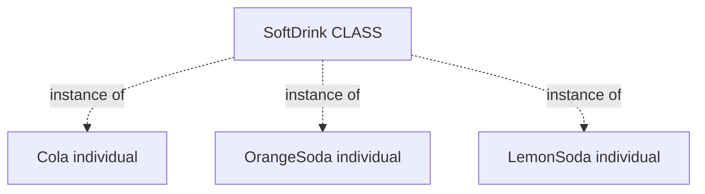
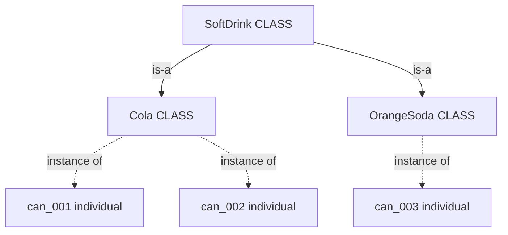
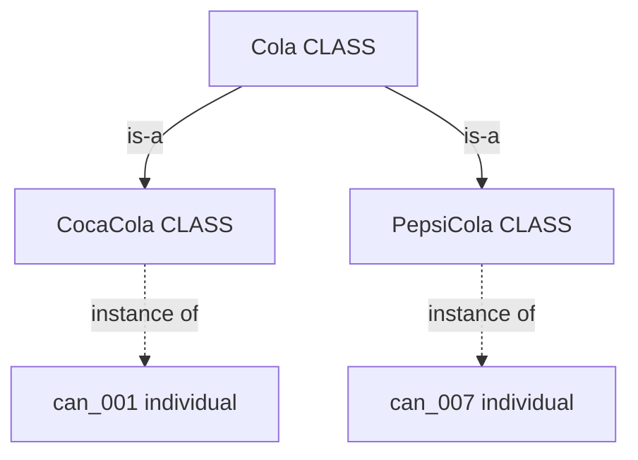

# 4.2 — Ontology Design Tips

**Instructor:** Hutchatai Chanlekha  
**Source:** `Knowledge Engineering (01219366)/References/4-2-Ontology_Tips for designing ontology.pdf`  
**Based on:** Noy & McGuinness, *Ontology Development 101*

## Outline

1. [[#1. No single correct hierarchy]]
2. [[#2. Correct IS-A and kind-of]]
3. [[#3. Hierarchy evolution (Zinfandel)]]
4. [[#4. Classes are concepts, not words]]
5. [[#5. No cycles]]
6. [[#6. Siblings]]
7. [[#7. How many direct subclasses]]
8. [[#8. Multiple inheritance]]
9. [[#9. New class vs property value]]
10. [[#10. Extrinsic properties (do not make ChilledWine a class)]]
11. [[#11. Instance vs class]]
12. [[#12. Limit the scope]]
13. [[#13. Naming conventions]]
14. [[#14. Thesaurus help]]

---

## 1. No single correct hierarchy

There is **no one correct** class hierarchy for a domain. The shape depends on:

- intended **uses** of the ontology
- **detail** the application needs
- personal modeling preference
- sometimes **compatibility** with other models

The rest of this lecture is a set of **guidelines**, not rigid laws.

---

## 2. Correct IS-A and kind-of

The hierarchy is an **is-a** (taxonomic) relation:

> Class A is a subclass of B **iff every instance of A is also an instance of B**.

Dog subclass of Animal ⇒ every dog is an animal.

Same idea as **kind-of**: a subclass is a *kind of* its superclass.

**Transitive:** if Dog ⊑ Mammal and Mammal ⊑ Animal, then Dog ⊑ Animal.

---

## 3. Hierarchy evolution (Zinfandel)

Domains change; a hierarchy that was correct can break.

| Old model               | Why it failed                | Redesign                                                                                                                               |
| ----------------------- | ---------------------------- | -------------------------------------------------------------------------------------------------------------------------------------- |
| `Zinfandel` ⊑ `RedWine` | All Zinfandel used to be red | After white/rosé Zinfandel appeared, put `Zinfandel` under `Wine`, with children `RedZinfandel` / `WhiteZinfandel` under color classes |

Lesson: when the domain invents a counterexample to your is-a assumption, **restructure** — do not keep a false subclass link.

---

## 4. Classes are concepts, not words

- A class names a **concept in the world**, not a particular English/Thai string.
- Renaming `Shrimps` → `Prawns` does not create a new concept.
- **Synonyms are not separate classes.** Do not create both `Dog` and `Canine`. One class; put synonyms in annotations / documentation / labels.

---

## 5. No cycles

![[Screenshot 2026-09-23 at 20.44.09.png|212]]

If A ⊑ B and B ⊑ A, every instance of A is an instance of B and vice versa ⇒ A and B are **equivalent**.

Avoid accidental cycles; they erase the distinction you thought you modeled.

---

## 6. Siblings

**Siblings** = direct subclasses of the same parent.

![[Screenshot 2026-09-23 at 20.44.38.png|411]]

Rules:

1. Same **level of generality**. `Coffee` and `Alcoholic` should **not** both be children of `Beverage` — Alcoholic is broader than Coffee.
2. Same **partition line** (same kind of cut). Good: `Alcoholic` / `NonAlcoholic` under `Beverage`.
3. **Exception:** children of the **root** may mix major domain divisions (the concepts at the root of the hierarchy normally represent major divisions of the domain).

---

## 7. How many direct subclasses

No hard rule, but well-structured ontologies often have ==2–12 direct children==.

| Symptom                             | Likely fix                                                                      |
| ----------------------------------- | ------------------------------------------------------------------------------- |
| Only **one** direct subclass        | Modeling gap, or incomplete ontology                                            |
| **More than ~12** direct subclasses | Add intermediate categories (e.g. under `Wine`: Red / White / Rosé / Sparkling) |

---

## 8. Multiple inheritance

![[Screenshot 2026-09-23 at 20.47.08.png|445]]

A class may have **several** parents.

Example: `PortWine` ⊑ `RedWine` and `PortWine` ⊑ `DessertWine` — every Port instance is both.

Parents can contribute different properties (`hasColor`, `hasTanninLevel` from red; `hasSugarLevel` from dessert). Watch for **conflicting** restrictions from those parents.

---

## 9. New class vs property value

Hardest modeling choice: is a distinction a **subclass**, or just a **slot value**?

### Balance

Too many nested classes → hard to navigate.  
Too flat + everything in properties → also hard. Aim for a middle.

### When subclasses usually earn their keep

A subclass typically should:

- add **properties** the parent lacks (e.g. tannin on red wine), **or**
- use **different restrictions** (e.g. dessert wine sugar = HIGH), **or**
- take part in **different relations**

Practically: new property, new property value, or overridden facet.

### When classes without new properties are still OK

- **Terminological** taxonomies (disease lists): hierarchy for navigation and choosing the right generality, even with no extra slots.
- Domain experts **routinely treat** them as different kinds — reflect that for communication.

### Scope decides class vs value

| Situation | Prefer |
| --- | --- |
| Distinction does not change behavior (wine-label factory: color barely matters) | Property `hasColor` on `Wine` |
| Distinction drives other rules (food pairing: red ≠ white) | Subclasses `RedWine`, `WhiteWine`, … |
| Different values become **restrictions for other classes** | New classes for the distinction |
| You think of them as different **kinds** of object | New classes |

**Ribs example:** if each rib has different adjacency, function, protected organs → one class per rib. If for your app all ribs behave alike → one class `Rib` with properties `order` and `lateralPosition`.

### Summary rule

> If different property values make objects restrict **other** properties differently, or if they are different **kinds** in the domain → **new class**. Otherwise → **property value**.

---

## 10. Extrinsic properties (do not make ChilledWine a class)

Membership in a class should **not change often**.

Using **extrinsic** (temporary, situation) properties as class cuts forces instances to migrate constantly.

**Chilled wine** in a restaurant bottle ontology: do **not** make `ChilledWine` a class. Use a property `chilled` on the bottle — the same wine stops being chilled after it warms up.

Prefer **intrinsic** distinctions for class cuts.

---

## 11. Instance vs class

Depends on the **application** and **granularity**.

> The most specific entities that answer your ==**competency questions**== are good candidates for ==**individuals**==.

The tree **stops** at whatever you will actually answer with. `Cola` as a class does **not** mean “types of cola under it.” It means: the members of `Cola` are the objects you track at that depth.

| Application | Deepest answer | So `Cola` is |
| --- | --- | --- |
| Soft-drink **recommender** (kinds only) | “Cola” | **individual** of `SoftDrink` |
| Convenience-store **inventory** | this can on this shelf | **class**; cans are individuals |

### Recommender — `Cola` is an individual

Ask: *what should I drink?* Answer is **Cola**. There are no bottles in the KB.

### Inventory — `Cola` is a class; cans are individuals

Ask: *what expires this week?* Answer is **can_003**, not “OrangeSoda.” Each can has its own expiry, barcode, shelf.

| | Recommender | Inventory |
| --- | --- | --- |
| Deepest answer | `Cola` | `can_001` |
| `Cola` is | **individual** | **class** |
| Store expiry per can? | No — there are no cans | Yes |

Solid arrows = is-a (class → class). Dotted = instance-of (class → individual).

### Brands only if CQs need them

`CocaCola` / `PepsiCola` appear **only** if the shop asks brand questions. Even then the **individuals are still cans**:

---

## 12. Limit the scope

An ontology is complete enough when it has ==what the application needs==, not everything about the domain.

- Do not specialize or generalize more than needed — **at most one extra level** each way.
- Do not add every possible property/distinction beyond the task.

---

## 13. Naming conventions

Pick a convention and **stick to it**. ==Consistency== avoids modeling mistakes.

### Check the tool first

- Shared namespace for classes/properties/instances? Same name allowed for class and property?
- Case-sensitive? (`Winery` vs `winery`)
- Allowed delimiters (space, `_`, `-`, …)

### Capitalization and multi-word names

Common pattern (if case-sensitive):

- Classes: initial uppercase (`Wine`)
- Properties: initial lowercase (`hasMaker`)

Multi-word options (pick one style): space (`Meal course`), camel (`MealCourse`), underscore/dash (`Meal_Course`, `Meal-Course`).

### Singular vs plural

==Singular class names are more common== (`Wine`). Plural (`Wines`) is fine if used **everywhere**. Consistency > which choice.

### Property prefixes / suffixes

To tell classes from properties at a glance:

- `has-` prefix: `has-maker`, `has-winery`
- or `-of` suffix: `maker-of`, `winery-of`

### Other naming rules

- Do **not** put `class`, `property`, `slot` in the name.
- Avoid abbreviations (`Cabernet Sauvignon`, not `Cab`).
- Sibling names: all include the parent name, or none do — not mixed.  
  OK: `Red Wine` + `White Wine`, or `Red` + `White`.  
  Bad: `Red Wine` + `White`.

---

## 14. Thesaurus help

When the domain is unfamiliar, use a thesaurus / taxonomy:

| Term | Role |
| --- | --- |
| **Hypernym** | more general concept |
| **Hyponym** | more specific concept |

Example (Planet): hypernym *celestial body*; hyponyms *giant planet*, *major planet*, *minor planet*, *terrestrial planet*, …  
(Reference on slide: [Wiktionary Thesaurus:planet](https://en.wiktionary.org/wiki/Thesaurus:planet))

---

## Takeaways

- Hierarchy = strict **is-a / kind-of**; transitive; **no cycles**; synonyms ≠ two classes.
- Siblings: same generality and same cut; watch 1-child and 12+-child smells.
- Multiple inheritance is allowed; watch conflicting parent facets.
- **Class vs property value** and **class vs instance** are decided by **scope and competency questions**.
- Do not classify on **extrinsic** traits (`ChilledWine`).
- Scope: only what you need (+ at most one extra level).
- Naming: one convention, consistent siblings, no junk suffixes/abbreviations.

---

## References

- Natalya F. Noy and Deborah L. McGuinness — *Ontology Development 101: A Guide to Creating Your First Ontology*  
  - https://protege.stanford.edu/publications/ontology_development/ontology101.pdf  
  - https://protege.stanford.edu/publications/ontology_development/ontology101-noy-mcguinness.html
