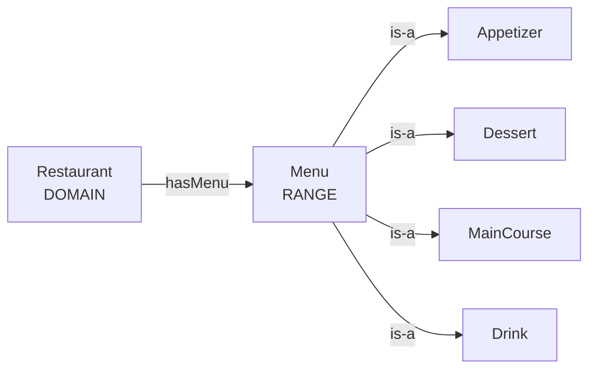
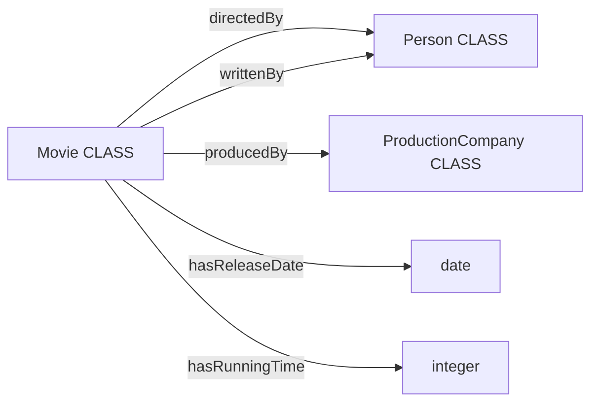

# 4.3 — Developing Ontology

**Instructor:** Hutchatai Chanlekha  
**Source:** `Knowledge Engineering (01219366)/References/4-3-Ontology_Steps of Developing Ontology_pre.pdf`  
**Based on:** Noy & McGuinness, *Ontology Development 101*

## Outline

1. [[#1. Why analysis comes first]]
2. [[#2. Three fundamental rules]]
3. [[#3. Iterative methodology]]
4. [[#4. Step 1 — Domain, scope, competency questions]]
5. [[#5. Step 2 — Reuse existing ontologies]]
6. [[#6. Step 3 — Enumerate terms]]
7. [[#7. Step 4 — Classes and hierarchy]]
8. [[#8. Step 5 — Properties]]
9. [[#9. Step 6 — Facets (including domain and range)]]
10. [[#10. Step 7 — Instances]]
11. [[#11. In-class exercises]]

---

## 1. Why analysis comes first

Given people-roles `Male`, `Female`, `Student`, `Professor`, `Employee`, it is tempting to hang **all of them** as siblings under `Human`.

That dump is the **wrong cut**. Sex (`Male` / `Female`) and role (`Student` / `Professor` / `Employee`) are **different partitions**. A professor can be female; a student can be an employee. Putting them as one sibling row pretends they are mutually exclusive kinds of human.

The lecture’s prompt after that diagram: *what should actually be subclass of Person?* — force a **single partition line** (or multiple inheritance / separate trees), not a bag of labels.

> Mixing unlike criteria under one parent is the typical failure of skipping analysis.

---

## 2. Three fundamental rules

1. There is **no one correct** model of a domain — several alternatives can work.
2. The better choice depends on the **application** and **extensions** you expect.
3. Concepts should stay close to **objects** (nouns) and **relationships** (verbs) in domain sentences.

---

## 3. Iterative methodology

Ontology building is **iterative**: rough first pass → revise, fill details, argue modeling choices (pros / cons / implications). Engineers **and** domain experts both belong in the loop.

Remember while iterating:

- **Use** and **generality vs detail** drive later decisions.
- Among viable models, prefer the one that fits the task, is intuitive, extensible, and maintainable.
- An ontology is a **model of the world**; concepts must reflect that world.
- Evaluate by running it in an application / problem-solver **or** by expert review (or both). Iteration lasts the whole lifecycle.

---

## 4. Step 1 — Domain, scope, competency questions

Answer before drawing classes:

| Question | Role |
| --- | --- |
| What **domain** does it cover? | Breadth |
| What will we **use** it for? | Purpose |
| What **questions** should it answer? | Competency |
| **Who** uses and maintains it? | Audience |

**Wine + food example.** Domain: wines and food. Purpose: suggest good combinations. Then you need wine types, food types, and “goes with.” Purpose also changes **slots**:

| Extra use | Extra knowledge |
| --- | --- |
| Restaurant customers ordering wine | **retail** price |
| Buyers stocking a cellar | **wholesale** price and availability |
| Maintainers speak a different language from users | **language mapping** |

**Competency questions** sketch the scope and later **test** the ontology: enough information? right level of detail? They need not be exhaustive.

Wine examples from the deck:

- Which wine characteristics matter when choosing?
- Is *this* wine a *xxx* type (red / white)?
- Does *this* wine go with *this* food? Best wine for *this* dish?
- Which characteristics affect appropriateness for a dish?
- Does bouquet or body change with vintage year?

> Avoid referring to **instances** in competency questions (do not scope the schema around one named bottle).

---

## 5. Step 2 — Reuse existing ontologies

Check whether you can **refine/extend** an existing ontology. Reuse can be **required** if other systems already committed to that vocabulary.

Libraries cited on the slides:

- [DBpedia Archivo](https://archivo.dbpedia.org/list)
- [Ontolingua](http://www.ksl.stanford.edu/software/ontolingua/)
- [DAML ontology library](http://www.daml.org/ontologies/)
- Commercial / public catalogs: [UNSPSC](http://www.unspsc.org), [RosettaNet](http://www.rosettanet.org), [DMOZ](http://www.dmoz.org)

---

## 6. Step 3 — Enumerate terms

Dump every important term: what we talk about, properties, what we want to say.

At this stage **do not** worry about overlap, relations, or class-vs-property.

Wine dump on the slides: wine, grape, winery, location, body, color, flavor, sugar content, food types (fish, red meat, …), wine subtypes (white, red, …).
![[Screenshot 2026-09-23 at 21.22.33.png|448]]![[Screenshot 2026-09-23 at 21.22.50.png|169]]

---

## 7. Step 4 — Classes and hierarchy

Three equally valid construction orders (choice is mostly how you *see* the domain):

| Approach | Start | Then |
| --- | --- | --- |
| **Bottom-up** | most specific (leaves) | generalize into parents |
| **Top-down** | most general (maybe from a foundational ontology) | specialize |
| **Middle-out** | **central** concepts per area | generalize **and** specialize |

Whichever you pick, first take Step-3 terms that name objects with **independent existence** — those become classes (anchors).

Place them with the is-a test: if something is an instance of B, is it **necessarily** an instance of A? Then A is superclass of B; B is a **kind of** A.

---

## 8. Step 5 — Properties

Classes alone cannot answer Step-1 questions. Remaining terms are often **properties**. Attach each to a class.

Wine: `color`, `body`, `flavor`, `sugar` on `Wine`; `location` on `Winery`.

**Attach at the most general class that always has the property.** Subclasses inherit. Body and color belong on `Wine`, not only on `RedWine`.

**Faculty people example** (hierarchy on the slide):

```
People in Faculty
    Faculty member
        Professor
        Staff
    Student
```

Property pool: `name`, `age`, `citizen_id`, `position`, `expertise`, `academic_position`, `officeRoom`, `grade`, `academic program`, `student_id`.

The exercise is to hang each slot on the **highest** class that all holders share (`name` / `age` / `citizen_id` on `People in Faculty`; `student_id` / `grade` / `academic program` on `Student`; staff/professor slots on `Faculty member` or below).

**Steps 4 and 5 intertwine** (a few classes, then properties, then more classes). They are the **most important** design steps.

---

## 9. Step 6 — Facets (including domain and range)

Facets constrain a property: **value type**, allowed values, **cardinality**, other features of fillers.

Examples: `name` → one string; `produce` (winery produces wines) → many values, each an instance of `Wine`.

| Facet           | Meaning                | Typical values                                            |
| --------------- | ---------------------- | --------------------------------------------------------- |
| **Value type**  | what can fill the slot | string, number, boolean, enumerated list, other class(es) |
| **Cardinality** | how many fillers       | max / min / exact number 3(wording depends on the tool)   |

**Domain** = classes the property is attached to / describes.  
**Range** = allowed classes (or datatype) of the value.

![[Screenshot 2026-09-23 at 21.27.53.png|648]]

Winery `--produce-->` Wine: domain `Winery`, range `Wine`. Winery must produce at least one wine ⇒ cardinality **some** / **min 1**. `name`: range string, cardinality **exactly 1**.

### Most general, but not overly general (`hasMenu`)

Rule: domain and range = the **most general** classes that still fit — **not** a grab-bag, **not** `owl:Thing`.

`hasMenu`, domain `Restaurant`. Menu hierarchy on the slides:

![[Screenshot 2026-09-23 at 21.29.59.png|413]]![[Screenshot 2026-09-23 at 21.31.38.png|469]]

The `???` is a prompt. **The correct range is `Menu`.**



The four children need no mention: anything that is an `Appetizer` already **is-a** `Menu`, so `Menu` covers them.

| Attempted range | Verdict | Why |
| --- | --- | --- |
| `Menu`, `Appetizer`, `Dessert` | Wrong | Parent mixed with **some** children; `MainCourse` / `Drink` missing |
| `Appetizer`, `Dessert`, `Drink` | Wrong | Incomplete — `MainCourse` omitted |
| `Appetizer`, `Dessert`, `MainCourse`, `Drink` | Not the answer they want | Lists every sibling instead of the parent; brittle if you later add `Side`. In Protégé, several listed classes = **intersection**, not union |
| **`Menu`** | **Correct** | Most general class that still fits: every appetizer/dessert/main/drink **is-a** Menu. Not overly general (`owl:Thing` would be) |

> [!important] Write this on the exam
> `hasMenu` — Domain: `Restaurant` · Range: `Menu`
> Do **not** list the children. Children are already covered by is-a.

### Multiple domains in Protégé (`hasFilling`)

Only burger and sandwich have filling; filling is any `Ingredient`.

Protégé treats several classes listed under Domain/Range as **intersection**. Listing `Burger` and `Sandwich` separately means “domain = Burger **and** Sandwich” (usually empty). Correct: one expression **`Burger or Sandwich`**, range `Ingredient`.

![[Screenshot 2026-09-23 at 21.36.23.png|158]]  ![[Screenshot 2026-09-23 at 21.36.39.png|552]]

---

## 10. Step 7 — Instances

Last: individuals.

1. Choose a class  
2. Create an individual of that class  
3. Fill property values  

---

## 11. In-class exercises

### 11.1 Movies table — class vs property (step by step)

Columns on the slide: Movie, Director, Screen Writer, Production Company, Release Date, Running time.  
Rows: *Spider-Man* / Sam Raimi / David Koepp / Columbia Pictures / May 3, 2002 / 121; *The Watchers* / I. Night Shyamalan / I. Night Shyamalan / Blinding Edge Pictures / June 7, 2024 / 203 (*names as on the slide*).

Walk it with the seven steps. The table is already a tiny domain — skip reuse.

**Step 1 — scope.** KB of films and who made them. CQs (no instance names): 
- Which person directed this movie? 
- Who wrote it? 
- Which company produced it? 
- When was it released? 
- How long is it?

**Step 2 — reuse.** Not required here.

**Step 3 — dump terms.** ==movie==, ==director==, ==screen writer==, ==production company==, ==release date==, r==unning time==, plus the row values as candidate individuals.

**Step 4 — classes** = terms with **independent existence** (things you could point at).

| Keep as class       | Why                                                                               |
| ------------------- | --------------------------------------------------------------------------------- |
| `Movie`             | the row subject                                                                   |
| `Person`            | ==directors and writers are people==; **one person can do both jobs** (Shyamalan) |
| `ProductionCompany` | Columbia Pictures, Blinding Edge Pictures                                         |

Do **not** make `Director` and `ScreenWriter` two sibling classes under `Person` as the only cut — that is the Male/Student trap: the same individual would have to pick one. ==Roles are properties== (or optional extra classes with multiple inheritance). Simplest exam write-up: one class `Person`.

`ReleaseDate` and `RunningTime` are not independent objects here — they are **values**.

```
Thing
    Movie
    Person
    ProductionCompany
```

**Step 5–6 — properties + facets**

| Domain | Property       | Range             | Type   | Facets                       |
| ------ | -------------- | ----------------- | ------ | ---------------------------- |
| Movie  | directedBy     | Person            | object | some (at least one director) |
| Movie  | writtenBy      | Person            | object | some                         |
| Movie  | producedBy     | ProductionCompany | object | some                         |
| Movie  | hasReleaseDate | date              | data   | Functional, exactly 1        |
| Movie  | hasRunningTime | integer           | data   | Functional, exactly 1        |

Attach all of these on `Movie` (most general — and only — owner).

**Step 7 — instances**

| Individual | Class | Notes |
| --- | --- | --- |
| Spider-Man | Movie | directedBy Sam Raimi; writtenBy David Koepp; producedBy ColumbiaPictures; date 2002-05-03; time 121 |
| TheWatchers | Movie | directedBy **and** writtenBy INightShyamalan (same person, two properties) |
| SamRaimi, DavidKoepp, INightShyamalan | Person | |
| ColumbiaPictures, BlindingEdgePictures | ProductionCompany | |



---

### 11.2 Food shop — one worked walkthrough (Sandwich / Hamburger)

Same method for ramen, coffee, … Pick **one** shop. Below: sandwich/hamburger (reuses `hasFilling` from this lecture).

**Step 1 — domain / CQs.** Domain: sandwiches and burgers sold in one shop. Purpose: “what can I order?” CQs: 
- What breads/fillings does this item have? 
- Is it vegetarian? 
- What does it cost?
- Who is allergic to peanut — what is safe?

**Step 3 — terms.** sandwich, burger, bread, filling, ingredient, meat, vegetable, cheese, sauce, price, vegetarian, peanut, …

**Step 4 — classes** (independent nouns). Do **not** dump `Vegetarian` as a sibling of `Sandwich` (that is a defined cut later, or a property).

```
Thing
    MenuItem
        Sandwich
        Burger
    Ingredient
        Bread
        Filling
            Meat
            Vegetable
            Cheese
            Sauce
```

Siblings `Sandwich` / `Burger` = same cut (item kind). Siblings under `Filling` = same cut (ingredient kind). Disjoint Meat / Vegetable / Cheese / Sauce if an ingredient cannot be two of those.

**Step 5–6 — properties** at the most general owner.

| Domain                 | Property   | Range      | Characteristics / facets                                         |
| ---------------------- | ---------- | ---------- | ---------------------------------------------------------------- |
| MenuItem               | hasPrice   | decimal    | Functional, exactly 1, `[>=0]`                                   |
| MenuItem               | hasName    | string     | Functional, exactly 1                                            |
| Sandwich **or** Burger | hasFilling | Ingredient | Protégé: domain `Sandwich or Burger`, **not** two listed domains |
| Sandwich               | hasBread   | Bread      | some                                                             |
| Burger                 | hasBun     | Bread      | some                                                             |

Vegetarian as a **defined** class (Equivalent To), not a sibling of Sandwich:

```
VegetarianItem  EquivalentTo
    MenuItem
    and (not (hasFilling some Meat))
```

**Step 7 — instances** (examples): `BLT` type Sandwich, fillings bacon/lettuce/tomato; `VeggieBurger` type Burger.

---

### 11.3 Food shop — Coffee shop (same seven steps)

**Step 1 — domain / CQs.** Domain: drinks sold at one coffee shop. Purpose: take orders and filter by diet. CQs: 
- What size/milk/shots does this drink have? 
- What is dairy-free? 
- What is caffeine-free? 
- What does it cost? 
Do **not** put “Iced Latte №3” in a CQ.

**Step 3 — terms.** coffee, espresso, latte, cappuccino, americano, drip coffee, tea, milk, oat milk, syrup, size, price, shot, caffeine, hot, iced, …

**Step 4 — classes.** Independent nouns. Do **not** make `Hot` / `Iced` / `Decaf` siblings of `Latte` (temperature and caffeine are cuts, not drink kinds — same trap as Male vs Student; also `ChilledWine`: a cup’s temperature should not be the class it *is*).

```
Thing
    Drink
        EspressoDrink
        BrewedCoffee
        Tea
    Milk
        DairyMilk
        PlantMilk
    Syrup
    Size
```

Siblings `EspressoDrink` / `BrewedCoffee` / `Tea` = same cut (how it is made). `DairyMilk` / `PlantMilk` = same cut (milk origin). `Latte` / `Cappuccino` / `Americano` ⊑ `EspressoDrink` if those named drinks need their own restrictions (latte must have milk; americano must have water).

**Step 5–6 — properties** on the most general owner.

| Domain | Property | Range | Characteristics / facets |
| --- | --- | --- | --- |
| Drink | hasPrice | decimal | Functional, exactly 1, `[>=0]` |
| Drink | hasName | string | Functional, exactly 1 |
| Drink | hasSize | Size | Functional |
| Drink | hasMilk | Milk | — (optional; not every drink has milk) |
| Drink | hasSyrup | Syrup | — |
| Drink | hasShotCount | integer | Functional; espresso drinks `min 1` |
| Drink | isIced | boolean | Functional — **not** a class `IcedDrink` |
| Drink | isDecaf | boolean | Functional |

```
EspressoDrink  SubclassOf
    Drink
    hasShotCount some integer [>=1]

Latte  SubclassOf
    EspressoDrink
    hasMilk some Milk
```

Defined classes for CQs (Equivalent To), not extra siblings under `Drink`:

```
DairyFreeDrink  EquivalentTo
    Drink
    and (not (hasMilk some DairyMilk))

CaffeineFreeDrink  EquivalentTo
    Drink
    and (isDecaf value true)
```

Range of `hasMilk` is **`Milk`**, not `DairyMilk, PlantMilk` listed separately (same `hasMenu` → `Menu` rule).

**Full map** (folders = classes / is-a; `#` = instance; `@` = property on that class). Defined classes are a separate folder — the reasoner puts matching drinks there; they are **not** children of `Drink`.

```
Thing/
├── Drink/                          ← properties below apply to every drink
│   ├── @ hasName        → string          (data, Functional, exactly 1)
│   ├── @ hasPrice       → decimal         (data, Functional, exactly 1, >=0)
│   ├── @ hasShotCount   → integer         (data, Functional)
│   ├── @ isIced         → boolean         (data, Functional)
│   ├── @ isDecaf        → boolean         (data, Functional)
│   ├── @ hasMilk        → Milk            (object)
│   ├── @ hasSyrup       → Syrup           (object)
│   ├── @ hasSize        → Size            (object, Functional)
│   │
│   ├── EspressoDrink/              ← + must have shotCount >= 1
│   │   ├── Latte/                  ← + must haveMilk some Milk
│   │   │   └── # Latte_hot_oat
│   │   │         hasMilk      OatMilk
│   │   │         hasSize      Grande
│   │   │         hasShotCount 2
│   │   │         isIced       false
│   │   ├── Cappuccino/
│   │   └── Americano/
│   │       └── # Americano_iced
│   │             isIced true
│   │             (no milk)
│   ├── BrewedCoffee/
│   │   └── DripCoffee/
│   └── Tea/
│
├── Milk/
│   ├── DairyMilk/
│   │   └── # WholeMilk
│   └── PlantMilk/
│       └── # OatMilk
├── Syrup/
└── Size/
    ├── # Tall
    └── # Grande

Defined/                               ← EquivalentTo, not under Drink/
├── DairyFreeDrink/                    ← Drink AND not (hasMilk some DairyMilk)
│   └── (reasoner puts Latte_hot_oat, Americano_iced here)
└── CaffeineFreeDrink/                 ← Drink AND isDecaf true
```


**Step 7 — instances**

| Individual | Class | Facts |
| --- | --- | --- |
| Latte_hot_oat | Latte | hasMilk OatMilk; isIced false; hasShotCount 2; hasSize Grande |
| Americano_iced | Americano | no milk; isIced true |
| OatMilk, WholeMilk | PlantMilk / DairyMilk | |
| Grande, Tall | Size | |

`Latte_hot_oat` classifies under `DairyFreeDrink` if that class is defined. It does **not** migrate in and out of an `IcedDrink` class when someone asks for it hot.


---

## Takeaways

- Do not dump unlike people-cuts (`Male` vs `Student`) as one sibling row under `Human`.
- Seven steps: **scope/CQ → reuse → terms → classes → properties → facets → instances**; 4 and 5 loop.
- CQ sketch the test; do not write instance names into CQs.
- Properties hang on the **most general** owner; domain/range likewise — in Protégé, multiple listed classes = **intersection**, so write `A or B` for union.
- Development is iterative with domain experts.

---

## References

- Natalya F. Noy and Deborah L. McGuinness — *Ontology Development 101: A Guide to Creating Your First Ontology*  
  - https://protege.stanford.edu/publications/ontology_development/ontology101.pdf  
  - https://protege.stanford.edu/publications/ontology_development/ontology101-noy-mcguinness.html
