> [!abstract] One map, whole course
> Keywords only — 330 nodes, seven units, one root. Companion to **X1**, which holds the *why*.
> Read a branch inward to see **where a concept sits**; read it outward to **regrow it from memory**. If a leaf is only a word you recognize, that's your revision gap.
> 💡 It's dense on screen. For a zoomable copy open **[[concept_mindmap.png]]** in a new tab.

```mermaid
mindmap
  root((Software Development Security))
    I VOCABULARY
      CIA
        Confidentiality
          Encryption
          Access control
          Broken by disclosure
        Integrity
          Hashing and checksums
          Digital signatures
          Broken by modification
          Depends on confidentiality
          But breaks without a breach
        Availability
          BCP and HA and DR
          Broken by DoS
          The orphan pillar
          Crypto serves C and I only
          Only TCB and state machine touch A
      Subject and Object
        Subject requests
        Object is requested
        Roles are per request
        Transitive trust bypasses
      AAA
        Authentication
          Password
          MFA
          Biometrics
        Authorization
          RBAC by role
          ABAC by attribute
          ACL
        Accounting
          Auditing means logs
          Accountability means who answers
        Non-repudiation is not a letter
        AuthN alone stops almost nothing
        Authorization is not intent
      Risk words
        Threat
        Vulnerability
        Risk is significance in context
        Control
        Residual risk
        Finding to Vulnerability to Scenario to Risk
        Bug to Vulnerability to Exploit to Impact
    II OBLIGES YOU
      Law
        Four questions
          Which regime reaches me
          Criminal or civil
          What must I do
          What makes my design risky
        Thai hierarchy
          Constitution supreme
          Constitutional Act extends not overrides
          Act and Emergency Decree
          Palace Law sits outside
        Criminal reads the letter
        Civil reads the intention
        Computer Crimes Act
          Access to system and to data
          Interception and wiretapping
          Damage and disruption and malware
          Content and false info and deepfakes
          Platform liability
          Does not cross borders
        Cybersecurity Act 2562
          NCSC
          Critical information infrastructure
        Intellectual property
          Copyright is automatic
          Patent rare for software
          Trademark
          Trade secret not clean-room RE
          GPL infects
          LGPL does not
          CC Share-Alike
      Privacy
        Three regimes
          GDPR follows the subject
          PDPA follows presence
          APPI weaker
          Ages sixteen and ten
        GDPR rights
          Know
          Correct
          Remove
          Limit
          Move
          Contest automation
          Enforce
        Erasure is a schema problem
        Consent is purpose-bound
        Definitions
          Personal data
          Processing
          Consent freely given and specific
        Sensitive data
          Health data
          Minors are the strictest
        Roles
          Controller decides why and how
          Processor acts on instructions
          DPO
          Roles follow what you do
          Unassigned roles are a risk
        Privacy by design
          Data minimization
          Retention is a number
          Consent form after design
        Reidentification
          Identified
          Pseudonymized still regulated
          Anonymized outside scope
          Quasi-identifiers
          Linkage attack
          Targeted filtering
          Small-cell inference
          Suppress and coarsen
          k-anonymity
          Split the system
          Dark patterns
      Standards
        ISO 27000
          27001 is certifiable
          27002 controls
        NIST
          800-53 controls
          800-218 SSDF integrates
        OWASP
          Top 10
          ASVS level two default
          MASVS
        PCI DSS twelve areas
        Microsoft SDL
          Twelve practices
          SD3 plus C
        Select then read then choose from risk
    III DECIDE
      Lifecycle
        Requirements review
        Design and threat model
        Implement and code review
        Test and pen test
        Deploy and harden
        Maintain and monitor
        Design fixes 30 to 60 times cheaper
        A loop not a line
        Conflicting requirements are a finding
      Risk
        Likelihood times Exposure
        A coarse judgement
        Treatment
          Mitigate
          Accept and document
          Transfer
          Avoid
        Controls are prevent and bound and recover
        Treatment is not controls
        Organizational risk
          Unclear roles
          Third party
          Cross-border
          Scope creep
          Answer is split the system
      Threat modeling
        Enumerates while risk prioritizes
        Objective predates the software
        Model the system
          Actors and flows and stores
          Entry points
          Trust boundaries
          Boundaries not boxes
          CWE-501
          Validation is the gate
        Threats are not only attackers
        STRIDE
          Spoofing breaks authentication
          Tampering breaks integrity
          Repudiation breaks accountability
          Disclosure breaks confidentiality
          DoS breaks availability
          Elevation breaks authorization
          A prompt not the method
          Finds but does not rank
        Four questions equal four steps
      Requirements
        Positive and negative
        Must be able to fail a test
        Names principal and object
        Ships a negative test
    IV DESIGN
      Family A limit reach
        Least privilege
        Fail-safe defaults
        Separation of duties needs collusion
        Separation of privilege needs many checks
        Least common mechanism
        Minimize attack surface
        Abstraction
      Family B check everything
        Complete mediation
        Zero trust
        Trust boundaries
        Castle and moat died
      Family C small and open
        Economy of mechanism cuts complexity
        Rule of least power cuts capability
        KISS and DRY and YAGNI
        Open design
        Data hiding is not obscurity
      Family D degrade safely
        Fail securely
        Defense in depth independent layers
        Prevent and bound and recover
        Weakest link
        Failure management is handling plus validation
      Family E human workable
        Psychological acceptability
        Blocks user enumeration
        Strategic friction
        Secure defaults
      Fail and default family
        Secure defaults is configuration
        Fail-safe defaults is access
        Fail securely is how it breaks
        Fail-open prioritizes availability
        Fail-closed prioritizes C and I
        Fail-safe flips in the physical world
        Fail-soft stays alive
      Formal models
        TCB
          Security perimeter
          Trusted path
          Reference monitor checks
          Security kernel implements
        State machine by induction
        Information flow
        Take-Grant traces rights
        Access control matrix
          ACL per object
          Capability list per subject
        Bell-LaPadula no read up no write down
        Biba no read down no write up
        Clark-Wilson through programs
        Brewer-Nash conflict of interest
      Platform enforcement
        Bounds
        Confinement is sandboxing
        Isolation is the result
        Trust is present assurance is reliable
        Memory protection
        Virtualization
        TPM
        Constrained interfaces
        Fault tolerance is redundancy
    V BUILD
      Secure coding
        Validate input
          Server-side
          Allowlists
          Data separate from commands
          SQL injection and XSS and command injection
        Authorization server-side
        Protect sensitive data
          TLS in transit
          Hash and salt
          Secret management
          Never roll your own crypto
        Sessions and errors and logs
        Dependencies are inherited risk
      Destructive operations
        Authorization is not intent
        LIMIT 1 is a guardrail not proof
        Bound the damage
        Show scope before irreversible
        Two-person control
      Cryptography
        Serves C and I never A
        Classical
          Caesar and ROT13
          Vigenere polyalphabetic
        Symmetric
          AES
          Block versus stream
          DES broken at 56-bit
          Exchange is the hard part
        Diffie-Hellman 1976
        Asymmetric
          RSA factoring
          ECC discrete log
          Solves key distribution
          Shor breaks RSA
        Hybrid is the standard pattern
        Digital signatures
          Private signs public verifies
          Authenticity not secrecy
          Proves the key not the identity
        PKI
          Certificate Authority
          Root self-signed
          Subordinate vouched for
          Revocation
    VI PROVE
      Six mechanisms
        Review proves the requirement
        Security tests prove the requirement
        SAST finds patterns
        SCA finds dependencies
        DAST finds runtime
        Pen test finds attack paths
        Only two of six prove yours
      Static versus dynamic
      Triage
        Validate the finding
        Check reachability
        Score in context
        Treat or accept or escalate
        Reassess residual risk
    VII CHOOSE
      Cryptographic choice
      Verification choice
      Access control choice
      Formal model choice
      Standard choice
      Treatment choice
      Privacy technique choice
```

---

## Drilling with it

1. **Cover a branch and regrow it** from its parent keyword. Gaps become your revision list.
2. **Walk any leaf back to the root** — that path is the justification an exam answer needs.
3. **Spot the repeats.** *Least privilege*, *deny by default*, *trust boundary*, *split the system* and *residual risk* each appear in several units. Those recurrences are the cross-cutting ideas most likely to be tested.
